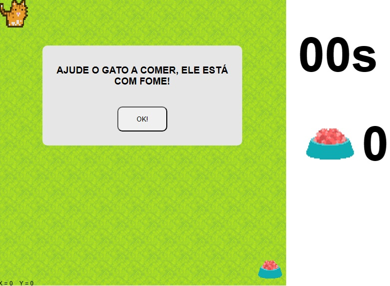

<h1 align="center"> CAT GAME </h1>

Um joguinho bobo de gatos criado por mim.

  <a href="#-tecnologias">Tecnologias</a>&nbsp;&nbsp;&nbsp;|&nbsp;&nbsp;&nbsp;
  <a href="#-projeto">Projeto</a>&nbsp;&nbsp;&nbsp;|&nbsp;&nbsp;&nbsp;
  <a href="#-layout">Layout</a>

 

  

## 🚀 Tecnologias

Esse projeto foi desenvolvido com as seguintes tecnologias:

- HTML e CSS
- JavaScript
- Git e Github

## 💻 Projeto

O cat game foi criado apenas por diversão e aprendizado.

## 🔖 Layout

Não houve um layout.

## 📝 Licença

Esse projeto está sob a licença MIT.

---

Feito com ♥ com ensinamentos da Cubos Academy!
